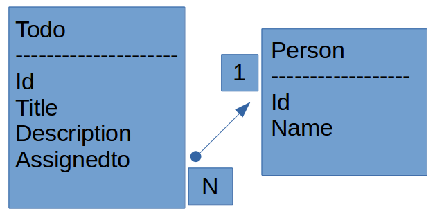

# Beadandó feladat

Alkalmazások feljesztése 3.beadandó
Kigyós János
LQPTEW

## Követelményanalízis

#### Családi todo program.
A feladatnak mininálisan tartalmaznia kell:

- legalább két modellt, egy-sok kapcsolatban
- legalább 1 űrlapot
- legalább 1 listázó oldalt
- legyen lehetőség új felvételére
- legyen lehetőség meglévő szerkesztésére
- legyen lehetőség meglévő törlésére
- REST API végpont kialakítása
- szerveroldali perzisztálás fájlba

## Felhasználói dokumentáció

A program egy egyoldalas weboldalként van implementálva.
A Családi TODO lista használata:

Az új TODO felviteléhez a beviteli mezőket kell kitölteni, cím(title), leírás(description), kihez lesz rendelve a TODO(assignedto) mezőkben.
Ez után a "hozzáad" gombra kattintva tudjuk hozzáadni a TODO-t a listához.

Szerkesztéshez kattintsunk egy 'szerkesztés' gombra, ekkor megjelenik egy új sor a táblázatban beviteli mezőkkel és mellete egy 'Módosít gombbal'.
Ez után kattintsunk a szerkeszteni kívánt TODO-val egy sorban levő 'szerkeszt gombra' és ezzel kitöltődnek a szerkesztő mezők.
A kívánt módosításokat végrehajtva kattintsunk a 'Módosít' gombra és ezzel a szerkesztés kész.

Egy TODO törléséhez a törölni kívánt TODO-val egy sorban levő 'Törlés' gombot kell kattintani.

## Adatbázis terv

